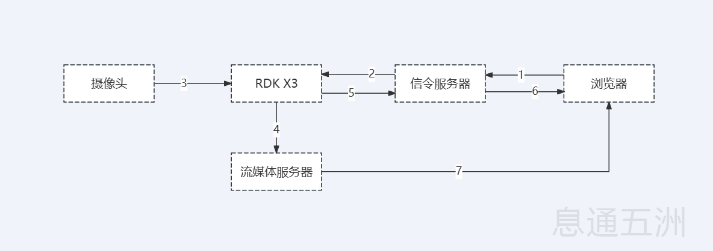
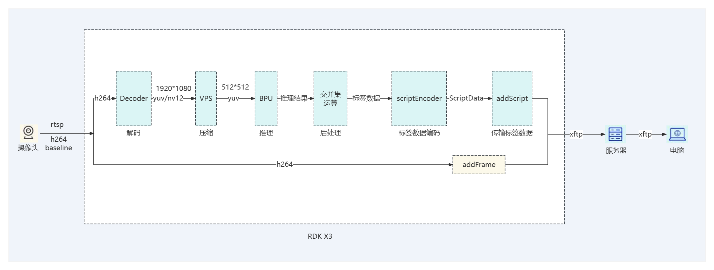

English| [简体中文](./README_cn.md)

# Feiliu Edge AI Video Gateway

This project contains the source code deployed for the Feiliu Edge AI Video Gateway, which is suitable for video AI recognition and real-time transmission in scenarios such as emergency response, security, and drone inspection. It features strong resistance to weak network conditions, effectively solving issues like jitter, delay, and screen tearing during remote video transmission, and achieves ultra-low latency remote real-time playback of AI-annotated video streams. This solution is based on the RDK X3 architecture, providing a powerful communication engine for the collaboration of intelligent agents. Developers can build real-time AI video applications tailored to their specific use cases based on this engine.

# Introduction

## Functional Introduction
The Feiliu Edge AI Video Gateway primarily addresses issues such as jitter, delay, screen tearing, and lack of intelligence encountered during remote video transmission in various scenarios (security, emergency response, drones, etc.). The gateway integrates a highly reliable and real-time proprietary communication middleware, achieving reliable video transmission with a packet loss rate of over 80% and a latency of only 0.2 seconds, significantly outperforming traditional real-time video transmission methods (such as RTMP, RTSP, WebRTC, etc.). Combined with the excellent AI analysis capabilities of RDK X3, it enables smooth display of remote ultra-low latency real-time AI-annotated video streams.

## Application Architecture

The main role of the RDK X3 box is to extract video streams from the local area network and use its powerful AI analysis capabilities to annotate the video streams in real-time. Subsequently, it leverages the self-developed high-real-time and high-reliable communication middleware to transmit the annotated information and video streams to the cloud.

## Feature Introduction
**1. Remote Real-time Video Viewing**

The Feiliu Edge AI Video Gateway features high reliability and low latency, with a packet loss resistance of over 80% and a latency of only 0.2 seconds.

**2. AI Annotation Structuring**

AI annotation structuring allows real-time adjustment of annotation content during remote viewing and enables secondary mining of marker information.

# Supported Platforms

| Hardware       | Platform    | Operating System          |
|----------------|-------------|---------------------------|
| RDK X3 Dev Board | RDK X3   | Ubuntu 20, Ubuntu 22      |
| RDK X3 Box      | RDK X3   | Ubuntu 20, Ubuntu 22      |

# Preparation

## Hardware Preparation
1. RDK X3 has been flashed with Ubuntu 20.04/Ubuntu 22.04 system image.
2. The camera is in H264 encoding format and supports any one of RTMP/RTSP/FLV streaming methods.
3. RDK X3 and the camera are on the same subnet.
4. RDK X3 can access the public network (Internet).

## Software Preparation
1. Visit the [Xitong Development Platform](https://open.zhilianxi.com/front/#/login) to register an account, create an application, and obtain APP authentication information.
2. Submit the device ID. For detailed operations, refer to the [Xitong Development Platform User Guide](https://github.com/steven-j-on-ai/XtERVGDemo/blob/main/README2.md#%E6%81%AF%E9%80%9A%E5%BC%80%E5%8F%91%E5%B9%B3%E5%8F%B0%E4%BD%BF%E7%94%A8%E6%8C%87%E5%8D%97).

# Trial Experience

## Download SDK and DEMO
**1. Configure DNS Service.**

Refer to [DNS Service Configuration](https://developer.d-robotics.cc/rdk_doc/System_configuration/network_blueteeth#dns%E6%9C%8D%E5%8A%A1) to complete DNS configuration.

**2. Installation and Running.**
```bash
# Unzip the downloaded package (the downloaded package name is randomly generated; "xt" is used here as an example. Please adjust according to the actual situation)
unzip xt.zip

# Enter the project directory
cd xt

# Modify the execution permission of the installation file
chmod +x setup_rdkx3.sh

# Run as root
sudo ./setup_rdkx3.sh

# After installation, check if the monitor process exists. (If not, check again after one minute)
ps -ef | grep -v grep | grep bin/monitor

# Monitor log directory
cd /usr/local/xt/logs
```
## Configure Channel Information

Refer to the [Feiliu Reliable Security Video Platform User Guide](https://github.com/steven-j-on-ai/XtERVGDemo/blob/main/README2.md#%E9%A3%9E%E6%B5%81%E5%8F%AF%E9%9D%A0%E5%AE%89%E9%98%B2%E8%A7%86%E9%A2%91%E5%B9%B3%E5%8F%B0%E4%BD%BF%E7%94%A8%E6%8C%87%E5%8D%97) for detailed operations on configuring channels.

## Check Channel Video and Trial Viewing
1. Check Channel Video (Run on RDK X3 box)
```bash
# Check if the xftp process exists (if not, check again after one minute)
ps -ef | grep -v grep | grep bin/xftp

# xftp log directory
cd /usr/local/xt/logs
```
# Integration SDK Development

## Architecture Description

1. Users send video viewing commands to the signaling server via a web browser.
2. The signaling server forwards the viewing command to the RDK X3 box.
3. After receiving the command, the RDK X3 box starts pulling the camera video stream and initiates decoding and inference threads for AI inference.
4. The RDK X3 box pushes the video stream and inference label data to the streaming media server.
5. The RDK X3 box sends video stream metadata to the signaling server.
6. The signaling server forwards the video stream metadata to the web browser.
7. After receiving the video stream metadata, the web browser immediately starts pulling the video stream and inference label data from the streaming media server for decoding and rendering playback.

## Basic Principle

**Prerequisites**: The RDK X3 box gateway program (hereinafter referred to as the gateway program) obtains h264 data from the video source (currently supports rtsp, rtmp, flv, and other video stream formats).
Note that the gateway program has two parallel processing logics: one is the forwarding process of h264 data, and the other is the process of video data decoding, compression, inference, and label data encoding transmission.

1. The gateway program receives h264 data and forwards it (addFrame) to the streaming media server.
2. The process of video data decoding, compression, inference, and label data encoding transmission.

   (1) The gateway program conveys the received h264 data to the decoder.
   
   (2) Another thread conveys the decoded yuv data to the VPS.
   
   (3) The output thread reads the compressed yuv data from the VPS and feeds it into the BPU.
   
   (4) The post-processing thread reads the inference result data from the BPU, performs post-processing to obtain video label data.
   
   (5) The post-processing thread encodes the video label data (scriptEncoder) and sends it into the SDK (addScript) to achieve remote reliable transmission of label data.
   
## Source Code Introduction
1. Initialize APP_KEY, APP_SECRET, LICENSE_KEY.
```bash
# Initialize APP_KEY, APP_SECRET, LICENSE_KEY
rt = initAppkeySecretLicense(APP_KEY, APP_SECRET, LICENSE_KEY);
```
2.Read the configuration information.
```bash
# Read the configuration
int read_config_xtvf(const char *channel_no);
```
3.Log in to the signaling server.
```bash
# Initialize the messaging SDK
int start_msg_client(void);
```
4.After receiving the video viewing instruction, initialize the connection to the multimedia server in the message callback.
```bash
# Start SDK streaming.
int start_live(void);
```
5.After successfully connecting to the multimedia server, obtain the video stream metadata in the success callback and push the metadata to the viewing end.
```bash
# Live SDK streaming initialization success callback
void xftpDidStart(long uidn, long ssrc, const char *remoteFilePath, const char *remoteServerName, int remoteServerPort, int downloadPort);
```
6.In the callback function for obtaining video frames, the video frames are fed into the video decoder. Subsequently, in a separate thread, the decoded data is sent to the VPS (Video Processing System) for processing. Finally, another thread sends the compressed video frame data into the BPU (Brain Processing Unit) for inference operations. The detailed process is described below.
```bash
# Start RTSP stream pulling
int start_pull_video(void);

# Start video frame decoding and inference thread
int start_bpu_and_push(void);

# Initialize the decoder
int vdecode_init(void *attr);

# Initialize the decoder channel
int sample_vdec_ChnAttr_init(VDEC_CHN_ATTR_S *pVdecChnAttr, PAYLOAD_TYPE_E enType, int picWidth, int picHeight);

# Initialize VPS
void vps_small_init(void);

# Start a thread to send the decoded data to VPS for processing
pthread_create(&getDecodeId, NULL, get_decode_data, &sample_vdec);
void *get_decode_data(void *attr);

# The above thread calls vps_small_process to send the decoded video frames to VPS for resizing
int vps_small_process(VIDEO_FRAME_S* stFrameInfo);

# Start a thread to read the VPS-compressed images and feed them into BPU
std::thread t1(fcos_feed_bpu);
void fcos_feed_bpu(void);

# Start a post-processing thread to read, post-process the inference results, encode, and transmit label data
std::thread t2(fcos_do_post);
void fcos_do_post(void);

# Transmit inference label data to the server
int add_script_frame(const char *script_data, int script_len, int inner_type, uint32_t timestamp);

# Push the video frame to the streaming media server
int add_xftp_frame(const char *h264oraac, int insize, int type, uint32_t timestamp);
```
7.Stop watching.
```bash
# Close the connection to the multimedia server
void stop_session0(uint32_t uidn, uint32_t ssrc);

# Stop the RTSP stream pulling
void stop_rtsp_over_tcp_thread(void);

# Release the decoder
HB_VDEC_StopRecvStream(g_vdecChn);
HB_VDEC_DestroyChn(g_vdecChn);

# Release VPS
void vps_small_release(hb_vio_buffer_t* chn_3_out_buf);
```
## Compile the Source Code
1.Compile the Source Code。
```bash
# Unzip the downloaded package (if already unzipped in the "Download and Try" step, please ignore)
unzip xt.zip

# Enter the project directory
cd xt/src

# Configure APP_KEY, APP_SECRET, LICENSE_KEY (fill in according to the developer application information)
vi xftp.cpp
#define APP_KEY "Application APP Key"
#define APP_SECRET "Application APP Secret"
#define LICENSE_KEY "Application APP License"

# Compile the source code and install
make && make install
```
## Viewing Trial
Log in to the [Feiliu Reliable Security Video Platform](https://monitor.zhilianxi.com/videoMonitorPlatform/index.html#/login) to conduct a trial viewing (limited application traffic is available, so please plan your usage reasonably).
## Appendix  
XTPP Message Command Description.

| Command Type | Example | Description | Parameter Description |
| --- | --- | --- | --- |
| Start Streaming Command | `type=6;`<br>`control_type=6;` | Sent from the streaming client to the streaming server. After receiving this command, the streaming server starts pushing the stream to the server and sends the “Video Stream Metadata Command” to the streaming client after successful streaming. | `type=6`: Indicates a control command<br>`control_type=6`: Indicates the start streaming command |
| Video Stream Metadata Command | `type=6;`<br>`control_type=2;`<br>`uidn=1234567890;`<br>`ssrc=987654321;`<br>`server_name=r1.wolianxi.com;`<br>`download_port=10961;` | Sent from the streaming server to the streaming client. After receiving this command, the streaming client starts pulling the stream from the server based on the command content. | `type=6`: Indicates a control command<br>`control_type=2`: Indicates the video stream metadata command<br>`uidn`: File transfer session identifier 1<br>`ssrc`: File transfer session identifier 2<br>`server_name`: IP address or domain name of the media server<br>`download_port`: Port number of the media server |
| Stop Streaming Command | `type=6;`<br>`control_type=3;` | Sent from the streaming client to the streaming server to stop the stream pushed to the server. | `type=6`: Indicates a control command<br>`control_type=3`: Indicates the stop streaming command |
| Inquiry Online Status Command | `type=6;`<br>`control_type=5;` | After receiving this command, the recipient must send their online status command to the sender. | `type=6`: Indicates a control command<br>`control_type=5`: Indicates the inquiry online status command |
| Online Status Command | `type=6;`<br>`control_type=4;`<br>`from=43c50b70203d1d7c6e341bc027a3bc77001;`<br>`is_online=0;` | After receiving this command, the recipient can determine the online status of the sender based on the command content. | `type=6`: Indicates a control command<br>`control_type=4`: Indicates the online status command<br>`from`: The account of the sender (if it is a channel number, it indicates the online status of that channel)<br>`is_online`: Online status, 0 indicates offline, 1 indicates online |

## Contact Us  
**If you encounter any issues during development that you cannot resolve, you can contact us through the following methods:**  

Contact Number: 010-64759451  

WeChat QR Code: Scan the QR code below to obtain the group QR code, and then long press to identify the QR code to join the group.  


