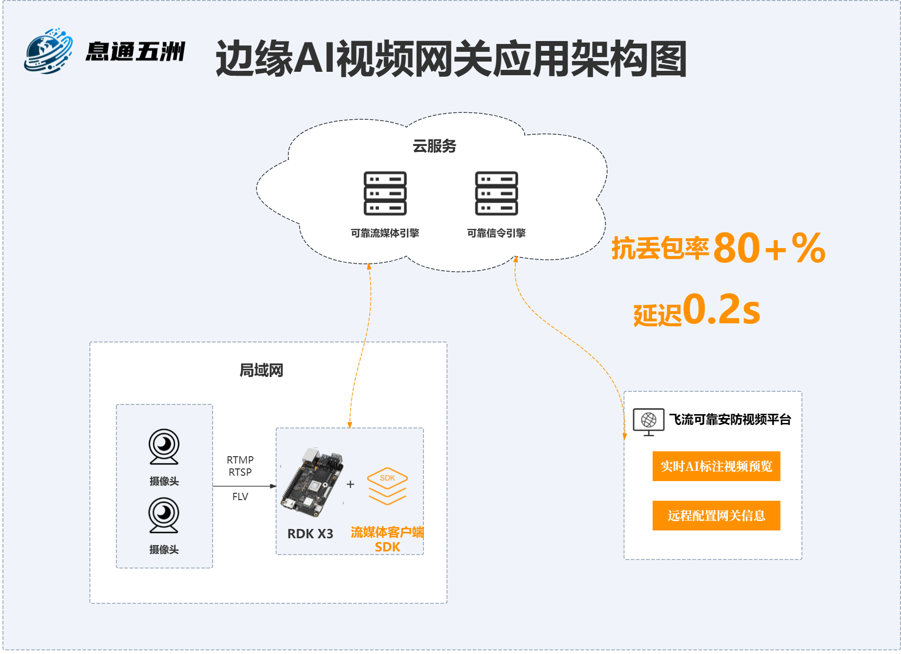

# XtERVGDemo
本项目为飞流边缘AI视频网关盒子所部署的相关源程序代码，它适用于应急、安防、无人机巡检等场景下的视频AI识别与实时传输的需求。具备超强的抗弱网特性，完美解决了此类视频远程传输中的卡顿、延迟、花屏等问题,实现了AI标注视频流的超低延迟远程实时播放。为实现智能体的协同提供了一个强有力的通信引擎。本方案是基于RDK X3架构实现的。各位开发者可以基于此引擎开发适用于自己应用场景的实时AI视频应用。
# 简介
## 功能介绍
边缘智能网关盒子主要解决各类（安防、应急、无人机等）视频远程传输时遇到的卡顿、延迟、花屏，以及缺乏智能等问题。该网关集成了高实时高可靠的自研通讯中间件，实现了 70+%丢包率下的可靠视频传输效果，远程传输时延迟仅为 0.2 秒，远超传统实时视频传输方式（如 RTMP、RTSP、WebRTC 等）。并且结合 RDK X3 卓越的 AI 分析能力实现了远程超低延迟的实时 AI 标注视频流的流畅展示。
## 应用架构
 
 RDK X3 盒子的主要作用是从局域网中提取视频流，并利用其强大的 AI 分析能力对视频流进行实时标注。随后，借助自主研发的高实时、高可靠通讯中间件，将标注信息及视频流传输至云端。
 ## 特色功能介绍
 **1.远程观看实时视频**
 
 边缘智能网关盒子具备高可靠、低延迟的特性，抗丢包能力可达到 70%以上，延迟仅为0.2 秒。
 
 **2.AI 标注结构化**
 
 AI 标注结构化使得远程观看可以实时调整标注内容，以及可以对标志信息进行二次挖掘。
 
# 支持平台
| 平台         | 操作系统                             | 
|--------------|--------------------------------------| 
| RDK X3       | Ubuntu 20、Ubuntu 22                |
# 准备工作
## 硬件准备工作
 1.RDK X3 已烧录好 Ubuntu 20.04/Ubuntu 22.04 系统镜像。
 
 2.摄像头为 H264 编码格式，且具备 RTMP/RTSP/FLV 任意一种取流方式。
 
 3.RDK X3 与摄像头在同一网段。

 4.RDK X3 可以访问公网（互联网）。
## 软件准备工作
 1.[息通开发者平台](https://open.zhilianxi.com/front/#/login)
