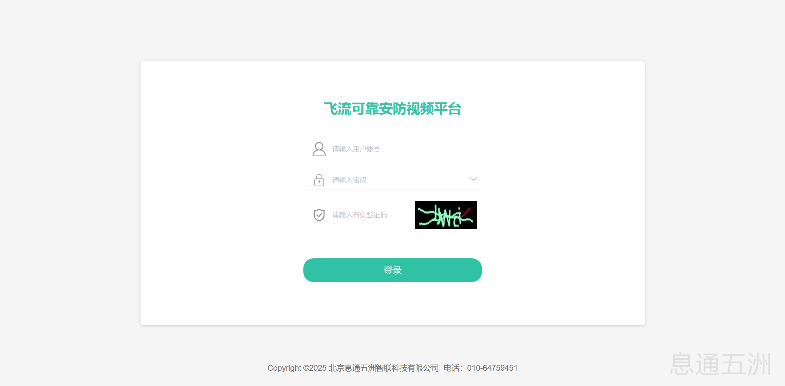
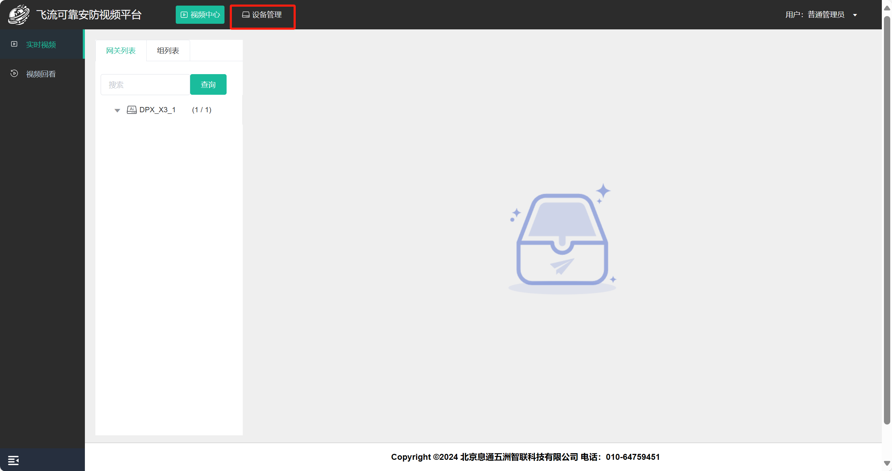
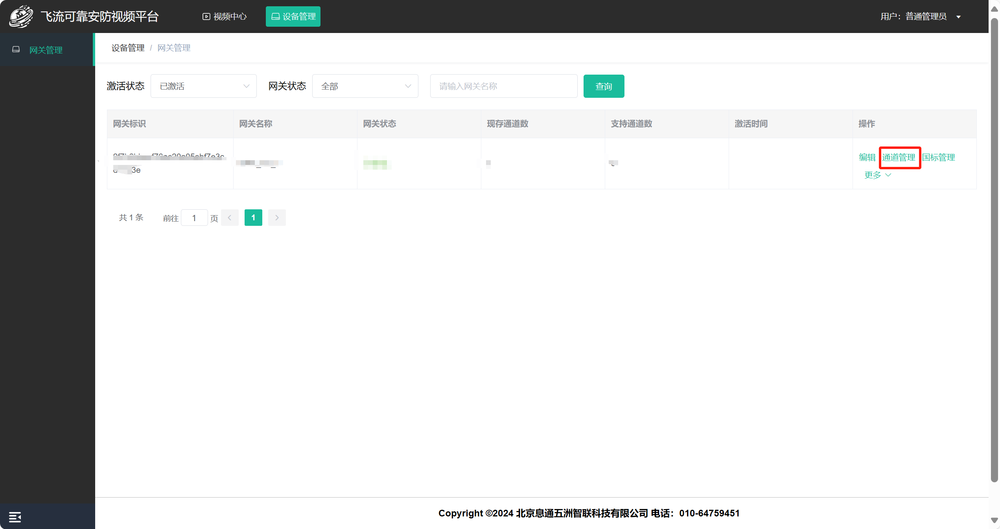
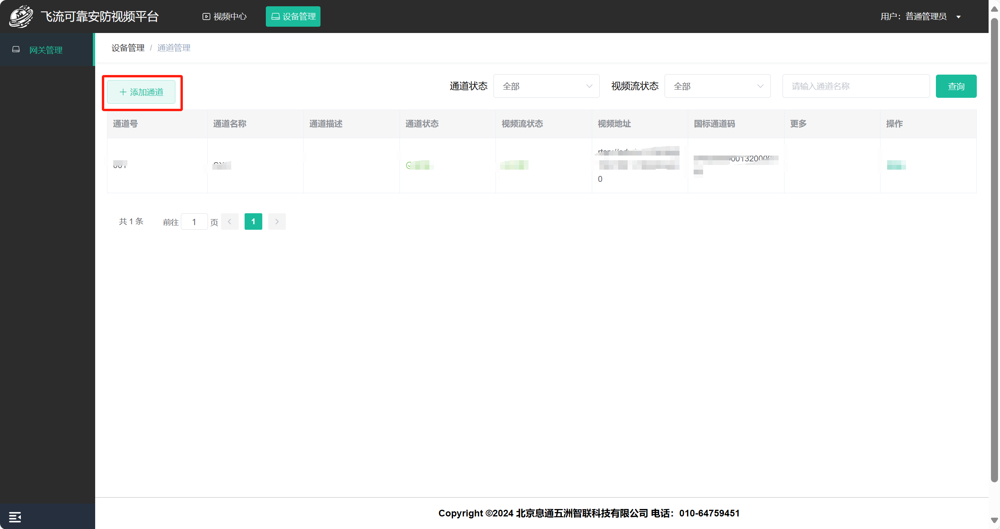
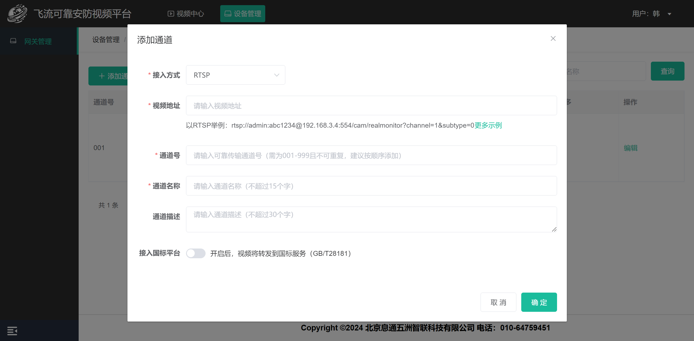
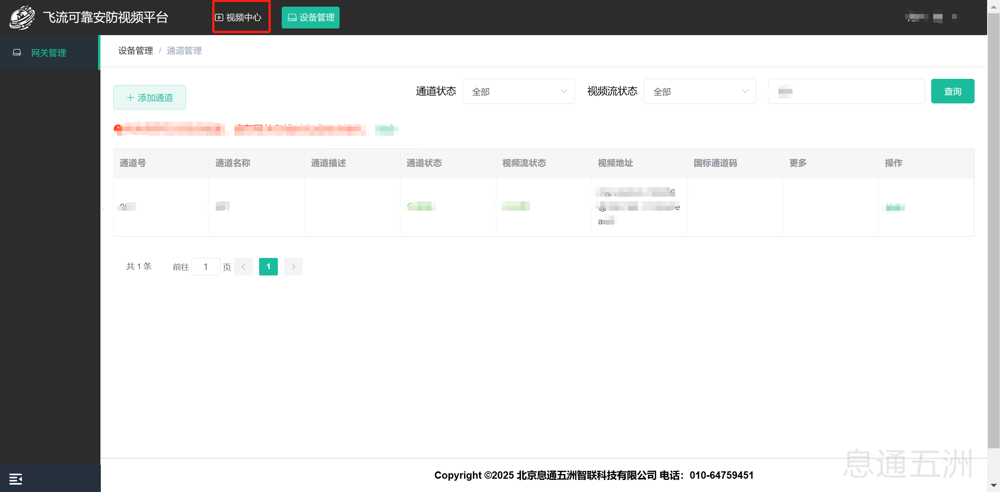
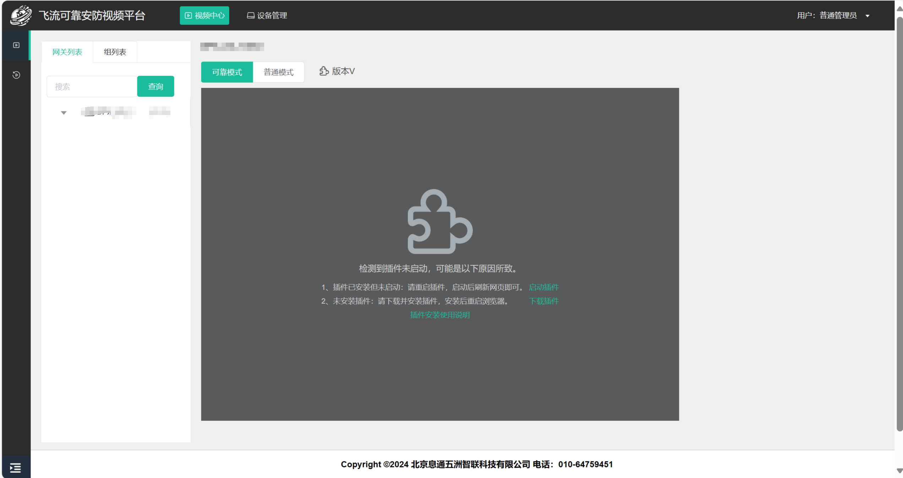

# 简介
本部分旨在为开发者提供项目开发过程中所需的关键信息，包括如何获取APP 鉴权信息及可运行的Demo程序。同时，详细介绍了如何在视频云平台配置相关信息，以及如何查看实时视频。

# 息通开发平台试用指南
## 注册登陆
前往[息通开发平台注册](https://open.zhilianxi.com/front/index.html#/register)，根据页面提示输入对应信息后进行注册。注册成功后即可进行登陆。
 
## 创建应用
登陆成功后进入应用中心，创建应用获取APP鉴权信息。创建APP 类型选择为边缘AI视频网关（RDK X3架构），其他信息可根据实际情况填写。

## 提交设备号
应用创建成功后，进入应用详情提交设备号获取可运行的Demo程序及相关SDK。

## 软件准备工作
 1.前往[息通开发平台](https://open.zhilianxi.com/front/#/login)注册账号，创建应用获取 APP 鉴权信息；
 
 2.提交设备号。
# 试用体验
## 下载 SDK 及 DEMO。
**1.配置 DNS 服务。**

请参考 https://developer.d-robotics.cc/rdk_doc/System_configuration/network_blueteeth#dns%E6%9C%8D%E5%8A%A1 ，完成DNS配置。

**2.安装及运行。**
```ba
# 解压下载的安装包（下载的安装包名称为随机生成，此处以xt举例，请根据实际情况进行调整）
unzip xt.zip

# 进入项目目录
cd xt

# 修改安装文件的执行权限
chmod +x setup.sh

# 以root身份运行
sudo ./setup.sh

# 安装完成后，检查monitor进程是否存在。（若不存在，请一分钟后再次查看）
ps -ef | grep -v grep | grep bin/monitor

# monitor日志所在目录
cd /usr/local/xt/logs
```

## 配置通道信息。
1.登录[飞流可靠安防视频平台](https://monitor.zhilianxi.com/videoMonitorPlatform/index.html#/login)，账号密码同息通五洲开发者平台登录账号密码一致。

 

2.进入系统后点击 顶部导航栏 中的"设备管理"。

 
 
3.点击网关下的“通道管理”进入通道管理的页面。



4.点击添加通道。



**通道：为网关中继的一条视频流。**
    
5.根据提示信息填写相应内容并确认。



在本对话框内填写本通道的接入视频流信息（支持 RTSP、RTMP、FLV 三种接入方式）。
注：本 DEMO 暂不支持接入国标平台。
## 检查通道视频及观看试用。
1.检查通道视频（在RDK X3盒子上运行）
```bash
# 检查xftp进程是否存在（若不存在，请一分钟后再次查看）
ps -ef | grep -v grep | grep bin/xftp

# xftp日志所在目录
cd /usr/local/xt/logs
```
2.查看通道视频

（1） 在[飞流可靠安防视频平台](https://monitor.zhilianxi.com/videoMonitorPlatform/index.html#/login)，点击顶部导航栏中的“视频中心”。

 
 
（2） 在“视频中心”的“实时视频”部分点击网关，选择先前添加的通道进行查看。


（3） 系统目前支持“可靠模式”与“普通模式”两种观看模式。



边缘AI视频标注仅能使用可靠模式进行体验，请下载插件。插件安装请参考飞流视频播放器插件使用说明。

（4） 观看效果。https://www.bilibili.com/video/BV1PTKHegEor/

**注：应用可用流量有限，请合理规划使用。**
# 集成SDK开发
## 架构说明

1.用户通过浏览器发送收看视频指令到信令服务器；

2.信令服务器将收看指令转发给RDK X3盒子；

3.RDK X3盒子在接收到指令后开始拉取摄像头视频流并启动解码推理等线程进行AI推理；

4.RDK X3盒子将视频流及推理标签数据推送到流媒体服务器；

5.RDK X3盒子将视频流元信息发送至信令服务器；

6.信令服务器将视频流元信息转发至浏览器；

7.浏览器接收到视频流元信息后立即开始从流媒体服务器拉取视频流及推理标签数据以解码及渲染播放。
## 基本原理

**前置条件**：RDK X3盒子网关程序（以下简称网关程序）从视频源获取h264数据（当前支持rtsp、rtmp、flv等格式视频流）；
请注意，网关程序存在两条并行的处理逻辑：其一为h264数据的转发过程；其二为视频数据的解码、压缩、推理及标签数据编码传输过程。

1.网关程序接收h264数据并转发（addFrame）至流媒体服务器。

2.视频数据的解码、压缩、推理及标签数据编码传输过程。

（1） 网关程序将接收的h264数据输送至解码器；

（2） 另一线程将解码后的yuv数据输送至VPS；

（3）输出线程聪VPS中读取压缩后的YUV数据，并将其喂如BPU；

（4） 后处理线程从BPU中读取推理结果数据在进行后处理后获得视频标签数据；

（5） 后处理线程将视频标签数据编码（scriptEncoder）后送入SDK（addScript）以实现标签数据的远程可靠传输。
## 源码介绍
1.初始化APP_KEY、APP_SECRET、LICENSE_KEY。
```bash
# 初始化APP_KEY、APP_SECRET、LICENSE_KEY
rt = initAppkeySecretLicense(APP_KEY, APP_SECRET, LICENSE_KEY);
```
2.读取配置信息。
```bash
# 读取配置
int read_config_xtvf(const char *channel_no);
```
3.登录信令服务器。
```bash
# 初始化消息SDK
int start_msg_client(void);
```
4.收到观看视频指令后，在消息回调里初始化连接多媒体服务器。
```bash
# 开启SDK推流
int start_live(void);
```
5.连接多媒体服务器成功后，在成功回调里获取视频流元信息，并将元信息推送给观看端。
```bash
# live SDK推流初始化成功回调
void xftpDidStart(long uidn, long ssrc, const char *remoteFilePath, const char *remoteServerName, int remoteServerPort, int downloadPort);
```
6.获取视频帧的回调函数里将视频帧送入视频解码器，并在其后的线程中将获取的解码数据送入VPS处理，再由另一线程将压缩后的视频帧数据送入BPU进行推理操作。详细流程请见下方描述
```bash
# 启动 RTSP 拉流
int start_pull_video(void)

# 开启视频帧解码并进行推理线程
int start_bpu_and_push(void);

# 初始化解码器
int vdecode_init(void *attr);

# 初始化解码器channel
int sample_vdec_ChnAttr_init(VDEC_CHN_ATTR_S *pVdecChnAttr,  PAYLOAD_TYPE_E enType, int picWidth, int picHeight);

# 初始化VPS
void vps_small_init(void)

# 启动线程，将获取的解码数据输送至VPS处理
pthread_create(&getDecodeId, NULL, get_decode_data, &sample_vdec);
void *get_decode_data(void *attr);

# 上述线程内调用vps_small_process，将解码后的视频帧发送到VPS，进行尺寸缩放
int vps_small_process(VIDEO_FRAME_S* stFrameInfo);

# 开启线程从VPS读入VPS压缩后的图像喂入BPU
std::thread t1(fcos_feed_bpu);
void fcos_feed_bpu(void);

# 启动后处理线程，读取、后处理推理结果、编码并传输标签数据
std::thread t2(fcos_do_post);
void fcos_do_post(void);

# 传输推理标签数据到服务器
int add_script_frame(const char *script_data, int script_len, int inner_type, uint32_t timestamp);

# 将视频帧推送到流媒体服务器
int add_xftp_frame(const char *h264oraac, int insize, int type, uint32_t timestamp);
```
7.停止收看。
```bash
# 关闭多媒体服务器的连接
void stop_session0(uint32_t uidn, uint32_t ssrc);

# 停止 RTSP 拉流
void stop_rtsp_over_tcp_thread(void);

# 释放解码器
HB_VDEC_StopRecvStream(g_vdecChn);
HB_VDEC_DestroyChn(g_vdecChn);

# 释放VPS
void vps_small_release(hb_vio_buffer_t* chn_3_out_buf)
```
## 编译源码
1.编译源码。
```bash
# 解压下载的安装包（若“下载并试用”阶段已进行解压，请忽略）
unzip xt.zip

# 进入项目目录
cd xt/src

# 配置APP_KEY、APP_SECRET、LICENSE_KEY（根据开发者应用信息填写）
vi xftp.cpp
 #define APP_KEY "应用APP Key"
 #define APP_SECRET "应用APP Secret"
 #define LICENSE_KEY "应用APP License"

# 编译源码并安装
make &&make install
```
## 观看试用
登录[飞流可靠安防视频平台](https://monitor.zhilianxi.com/videoMonitorPlatform/index.html#/login)，进行观看试用（应用可用流量有限，请合理规划使用）。
## 附录
xttp消息指令说明。

| 指令类型 | 示例 | 说明 | 参数说明 |
| --- | --- | --- | --- |
| 开始拉流指令 | `type=6;`<br>`control_type=6;` | 拉流端发给推流端，推流端收到后开始向服务器推流，推流成功后给拉流端回“视频流元信息指令”给拉流端。” | `type=6`：表示这是一个控制指令<br>`control_type=6`：表示为开始拉流指令 |
| 视频流元信息指令 | `type=6;`<br>`control_type=2;`<br>`uidn=1234567890;`<br>`ssrc=987654321;`<br>`server_name=r1.wolianxi.com;`<br>`download_port=10961;` | 推流端发送给拉流端，拉流端收到后根据指令内容从服务器进行拉流。 | `type=6`：表示这是一个控制指令<br>`control_type=2`：表示为视频流信息指令<br>`uidn`：文件传输会话标识符1<br>`ssrc`：文件传输会话标识符2<br>`server_name`：流媒体服务器IP或域名<br>`download_port`：流媒体服务器端口号 |
| 关闭拉流指令 | `type=6;`<br>`control_type=3;` | 拉流端发给推流端，推流端收到后结束向服务器推流。 | `type=6`：表示这是一个控制指令<br>`control_type=3`：表示为关闭拉流指令 |
| 询问是否在线指令 | `type=6;`<br>`control_type=5;` | 收到该指令后需回自己的在线状态指令给发送方。 | `type=6`：表示这是一个控制指令<br>`control_type=5`：表示为询问是否在线指令 |
|  在线状态指令 | `type=6;`<br>`control_type=4;`<br>`from=43c50b70203d1d7c6e341bc027a3bc77001;`<br>`is_online=0;` | 收到该指令后，根据指令内容判断对方在线状态 | `type=6`：表示这是一个控制指令<br>`control_type=4`：表示为在线状态指令<br>`from`：对方账号（如果为通道号，即表示该通道的在线状态）<br>`is_online`：在线状态，0表示离线，1表示在线 |

