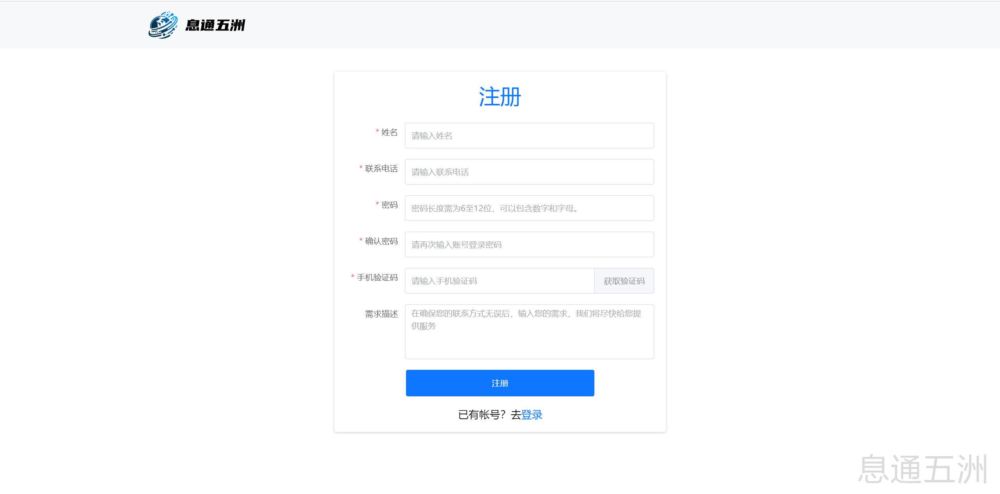
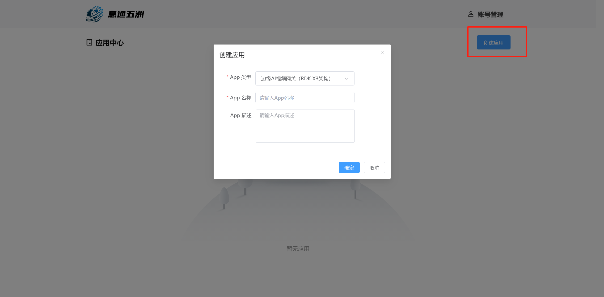
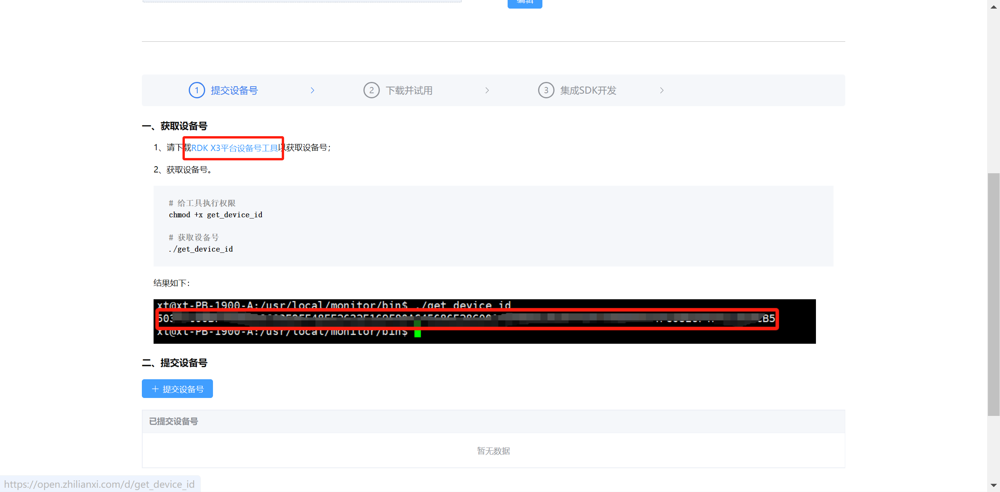
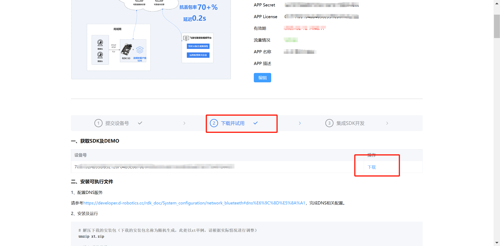

English| [简体中文](./README2_cn.md)

# Introduction
This section aims to provide developers with the key information needed during the project development process, including how to obtain APP authentication information and the runnable Demo program. Additionally, it details how to configure related information on the video cloud platform and how to view real-time video.

# Xitong Developer Platform User Guide
## Registration and Login
Visit the [Xitong Developer Platform Registration](https://open.zhilianxi.com/front/index.html#/register) page, enter the required information as prompted, and complete the registration. Once registered, you can log in.



## Create an Application
After logging in, enter the application center to create an application and obtain the APP authentication information. Choose the application type as "Edge AI Video Gateway (RDK X3 Architecture)", and fill in other details as appropriate.



## Submit Device ID
After successfully creating the application, go to the application details and submit the device ID to obtain the runnable Demo program and related SDK.

1. Download the RDK X3 platform device ID tool.



2. Obtain the Device ID
```ba
# Grant execution permission to the tool
chmod +x get_device_id

# Obtain the device ID
./get_device_id
```
3. Submit Device ID


## Obtain SDK and DEMO
After successfully submitting the device ID, the page will redirect to the second part "Download and Trial". You will need to wait for the staff to prepare the corresponding development package for you. Once completed, you will receive a text message. You can then proceed to download it.



# Feiliu Reliable Security Video Platform Usage Guide
## Login
Log in to the [Feiliu Reliable Security Video Platform](https://monitor.zhilianxi.com/videoMonitorPlatform/index.html#/login) with the same account and password as the Xitong Wuzhou Developer Platform.


## Configure Channels
1. After entering the system, click on "Device Management" in the top navigation bar.

   

2. Click on "Channel Management" under the gateway to enter the channel management page.

   

3. Click on "Add Channel".

   

**Channel: A video stream relayed by the gateway.**

4. Fill in the corresponding information according to the prompts and confirm.

   

Fill in the access information for the video stream of this channel in this dialog box (supports three access methods: RTSP, RTMP, and FLV).  
**Note:** This DEMO currently does not support access to the national standard platform.

## Viewing Experience
1. On the [Feiliu Reliable Security Video Platform](https://monitor.zhilianxi.com/videoMonitorPlatform/index.html#/login), click on "Video Center" in the top navigation bar.

   

2. In the "Real-time Video" section of "Video Center", click on the gateway and select the previously added channel to view.

   

3. The system currently supports two viewing modes: "Reliable Mode" and "Normal Mode".

   

Edge AI video annotation can only be experienced in Reliable Mode. Please download the plugin. For plugin installation, refer to the [Feiliu Video Player Plugin User Manual](https://monitor.zhilianxi.com/d/plugin_info.pdf).

4. Viewing effect: [Feiliu Edge AI Video Gateway Remote Viewing Effect on Bilibili](https://www.bilibili.com/video/BV1PTKHegEor/)

**Note:** The application's available traffic is limited, please plan your usage accordingly.

## Contact Us
**If you encounter any problems during the development process that you cannot solve, you can contact us through the following methods:**

Contact Number: 010-64759451

WeChat QR Code: Scan the QR code below to obtain the group QR code, and then long press to identify the QR code to join the group.


